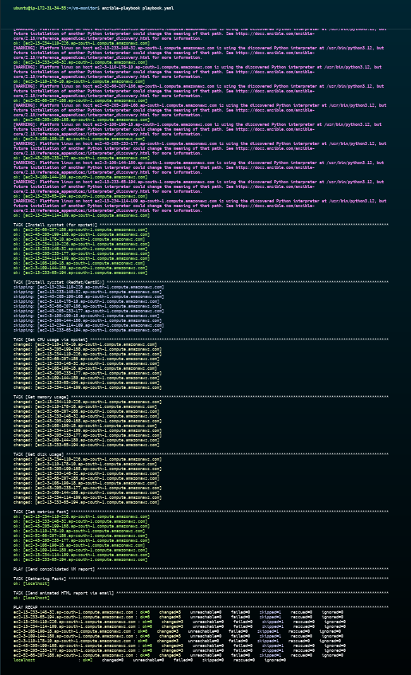
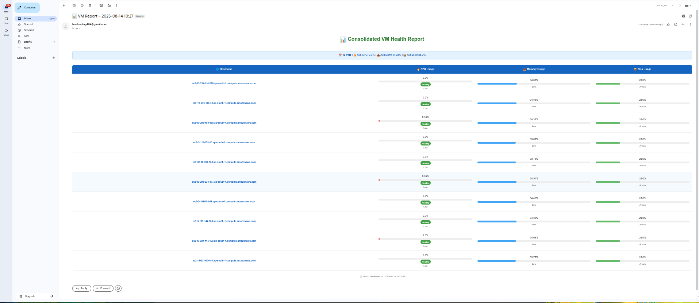

# 🖥️ Ansible Project to Monitor VMs Health

This project uses **Ansible** with AWS EC2 Dynamic Inventory to monitor and manage the health of running VMs based on tags (e.g., `Environment=dev`).  
It includes scripts for **tagging EC2 instances**, **copying SSH keys**, and **running Ansible playbooks** to collect system health data.

---

## 📌 Features
- 🔹 AWS EC2 **Dynamic Inventory** based on tags  
- 🔹 Automated **VM Tagging** (`web-01`, `web-02`, etc.)  
- 🔹 **SSH Key Injection** to multiple EC2 instances  
- 🔹 Health Monitoring via **Ansible Playbook**  
- 🔹 Works with **Environment-based filtering** (e.g., `dev`)

---

## 📋 Prerequisites
- AWS EC2 instances with proper **IAM Role / Access Keys**  
- Ubuntu/Debian control machine  
- AWS CLI installed & configured  
- Python 3 with `venv`  
- Public/Private SSH key pair  
- Ansible installed

---

## ⚙️ Installation & Setup

###  Update System
```bash
sudo apt update && sudo apt upgrade -y

```

### Add the Ansible PPA
- Ansible provides an official maintained PPA (for latest versions):

```
sudo add-apt-repository --yes --update ppa:ansible/ansible
```

###  Install Ansible
```
sudo apt install ansible -y
```

### Install AWS CLI
```
curl "https://awscli.amazonaws.com/awscli-exe-linux-x86_64.zip" -o "awscliv2.zip"
sudo apt install unzip
unzip awscliv2.zip
sudo ./aws/install
aws configure
```
### 🏷 Tagging Script
- tag.sh
```sh
#!/bin/bash

# Fetch instance IDs that match Environment=dev and Role=web
instance_ids=$(aws ec2 describe-instances \
  --filters "Name=tag:Environment,Values=dev" "Name=instance-state-name,Values=running" \
  --query 'Reservations[*].Instances[*].InstanceId' \
  --output text)

# Sort instance IDs deterministically
sorted_ids=($(echo "$instance_ids" | tr '\t' '\n' | sort))

# Rename instances sequentially
counter=1
for id in "${sorted_ids[@]}"; do
  name="web-$(printf "%02d" $counter)"
  echo "Tagging $id as $name"
  aws ec2 create-tags --resources "$id" \
    --tags Key=Name,Value="$name"
  ((counter++))
done
```

### ⚙ Ansible Configuration
- ansible.cfg
```cfg
[defaults]
inventory = ./inventory/aws_ec2.yaml
host_key_checking = False

[ssh_connection]
ssh_args = -o StrictHostKeyChecking=no -o UserKnownHostsFile=/dev/null
```

### 🌐 Dynamic Inventory
- inventory/aws_ec2.yaml
```yaml
plugin: amazon.aws.aws_ec2
regions:
  - ap-south-1
filters:
  tag:Environment: dev
  instance-state-name: running
compose:
  ansible_host: public_ip_address
keyed_groups:
  - key: tags.Name
    prefix: name
  - key: tags.Environment
    prefix: env   
```

### 🐍 Python Virtual Environment Setup
- Install venv module if not already present
```bash
sudo apt install python3-venv -y
```

- Create a virtual environment
```
python3 -m venv ansible-env
```

- Activate it
```
source ansible-env/bin/activate
```

-  Install required Python packages
```
pip install boto3 botocore docker
```

### 📊 Verify Inventory
```
ansible-inventory -i inventory/aws_ec2.yaml --graph
```

### 🔑 Copy Public Key to All Instances
- copy-public-key.sh
```
#!/bin/bash

# Define vars
PEM_FILE="key.pem"
PUB_KEY=$(cat ~/.ssh/id_rsa.pub)
USER="ubuntu"  # or ec2-user
INVENTORY_FILE="inventory/aws_ec2.yaml"

# Extract hostnames/IPs from dynamic inventory
HOSTS=$(ansible-inventory -i $INVENTORY_FILE --list | jq -r '._meta.hostvars | keys[]')

for HOST in $HOSTS; do
  echo "Injecting key into $HOST"
  ssh -o StrictHostKeyChecking=no -i $PEM_FILE $USER@$HOST "
    mkdir -p ~/.ssh && \
    echo \"$PUB_KEY\" >> ~/.ssh/authorized_keys && \
    chmod 700 ~/.ssh && \
    chmod 600 ~/.ssh/authorized_keys
  "
done
```
### 📂 Project Repository
- clone this repo
```
https://github.com/pratikgondkar/ansible-ec2-health-check.git
```

### Run the Playbook
```
ansible-playbook playbook.yaml
```

### 📷 Screenshots
### 📷 Screenshots





## 🛠️ Author & Community  

This project is crafted by **[Amit Kumar Jha](https://github.com/amitjha2112)** 💡.  
I’d love to hear your feedback! Feel free to share your thoughts.  

📧 **Connect with me:**

- **GitHub**: [amitjha2112](https://github.com/amitjha2112)   
- **LinkedIn**: [Amit Kumar Jha](https://www.linkedin.com/in/amit-kumar-jha-55b112216/)  

---

⭐ Support the Project
If you found this helpful, consider starring ⭐ the repository and sharing it with your network! 🚀
